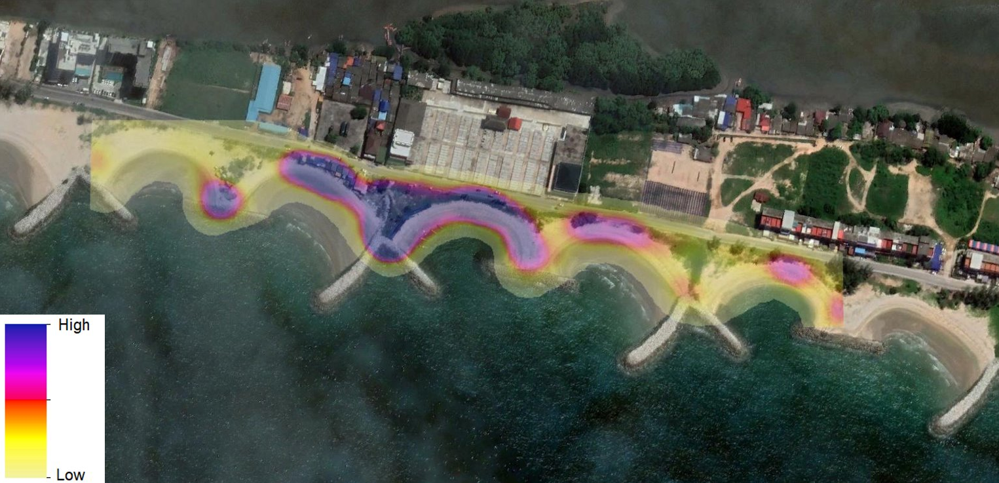

# pLitter - Teaching Computers to Identify Plastic Litter

pLitter is a standardized, deep learning friendly dataset and pre-trained model that can be used for detecting road-size plastic litter. Additionally, all supplementary codes related to this repository are also published here. *Example video showing plastic litter detection from our model (click on image to see the YouTube video) is shown below.*

<p align="center">
<a href="https://www.youtube.com/watch?v=REv0XEcWXVE" target="_blank">

</a>
</p>

These detections are currently being used to map plastic litter distribution in cities. *Example heat-map showing plastic litter distribution in a city is shown below.*

<p align="center">

</p>

_Note: This is a preliminary release and more data from more cities will be added in future._

## Motivation

Add some para about motivation

## Our Approach

In the conventional sense, typical machine learning pipeline consisted of collecting data, annotating data, training, validation and prediction. This is a very successful pipeline for many problems such as face detection, character recognition, etc. But the problem with plastic litter is, simply it is trash, it can be seen in various types, shapes, forms, backgrounds etc. So, variations are too complex to capture in a single model with a single annotated dataset. So we believe, the solution for this is Active Learning. Our ultimate goal would be to go beyond domain specific plastic litter detections, and provide detection capabilities in a wide range of cities (universal plastic litter detector). Schematic diagram of active learning framework that we are using for plastic litter identification problem is shows in the below Figure. 

<p align="center">

</p>


## Datasets

The datasets used in this repository can be downloaded from following links. Each link contains RGB images, plastic litter annotations (COCO format) and ReadMe file.

* [Talaad Thai](http://de0206d59054.ngrok.io/taladthai)
* [Rangsit](#)
* Ubon Ratchathani I (ongoing)
* Chiang Rai I (ongoing)
* Ubon Ratchathani II (ongoing)
* Chiang Rai II (ongoing)

*Note: We have used [COCO Annotator](https://github.com/jsbroks/coco-annotator) for generation of bounding box annotations. If you are planning to generate your own training data, it is a one option*

## Pre-trained models

Models that are trained separately for each of the datasets, as well as model that is trained on combined dataset can be downloaded from following links,

| Talaad Thai | Rangsit | Ubon Ratchathani I | Chiang Rai I | Ubon Ratchathani II | Chiang Rai II | <ins>Combined Dataset</ins> |
| --- | --- | --- | --- | --- | --- | --- |
| [Docker](#) | [Docker](#) | Docker (ongoing) | Docker (ongoing) | Docker (ongoing) | Docker (ongoing) | [Docker](#) |
| [EDGE Model](#) | [EDGE Model](#) | EDGE Model (ongoing) | EDGE Model (ongoing) | EDGE Model (ongoing) | EDGE Model (ongoing) | [EDGE Model](#) |
| mAP = xx | mAP = xx | mAP = (ongoing) | mAP = (ongoing) | mAP = (ongoing) | mAP = (ongoing) | mAP = (ongoing) |

| Model (trained on combined dataset) | Download | mAP |
| --- | --- | --- |
| Google AutoML | [EDGE Model](#), [Docker](#) | xx.xx |
| Mask RCNN | (ongoing) | (ongoing) |

*Note: These models are trained using [Google AutoML Vision tools](https://cloud.google.com/automl) in [Google Cloud Platform](https://cloud.google.com/).*

## Usage

Please add some technical details about basic use of repository.

__Dependencies:__

* numpy
* scipy
* Add more

## Documentation
Documentation is located in "docs" folder.

## Citation

Use this bibtex to cite us.
```
@misc{pLitter_2021,
  title={pLitter - Teaching Computers to Identify Plastic Litter},
  author={We have to add names here},
  year={2021},
  publisher={Github},
  journal={GitHub repository},
  howpublished={\url{https://github.com/gicait/pLitter/}},
}
```

## Developed by

[Geoinformatics Center](www.geoinfo.ait.ac.th) of [Asian Institute of Technology](www.ait.ac.th) and [Google Sustainability Team](https://sustainability.google/).

## Funding

[CounterMEASURE](https://countermeasure.asia/) project of [UN Environment Programme](https://www.unep.org/).
