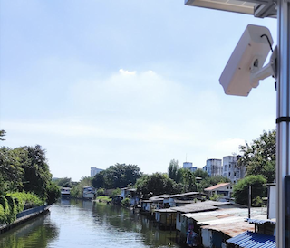

# pLitter - Plastic Litter identification and monitoring

An initiative of GIC-AIT to address the plastic pollution through leveraging the Deep Learning and geospatial technologies. pLitter tool and its modules enbale us to map or monitor the plastic pollution in various parts of the outdoor environment. pLitter follows 4M (MAN, MACHINE, MAPPING, AND MONITORING) and uses different tools/methods for data (image/videos) colelction mathcing to the location of plastic pollution, and Deep Learning based object detectors for litter objects identification in the collected data. 

* * * * *

## # Mapping


Surveying the roadsides and streets at city scale reveals the littering conditions such as identification of hotspots. The feasible and cost-effective way is using vehicle mounted cameras for data collection. AI algorithms can detect the macro plastic litter in the imagery and it can be associated with the corresponding GPS location. We successfully used this method to map the city scale level in two cities Chiang Rai and Ubon Ratchathani in Thailand, Hanwella and Mawanella in Sri Lanka, and Can Tho in Vietnam. We call this approach as pLitter-Street

pLitter-Street helps to make predictions to detect theplastic litter in the images/videos and these detections are being used to map plastic litter distribution (as snapshot of plastic pollution) in the cities. *Example heat-map of a beach at Rayong(Thailand) is showing plastic litter distribution in a city is shown below.* Visit https://plitter.org/street or https://gicait.github.io/pLitter/street/ plitter street mapping here.

[](https://www.youtube.com/watch?v=REv0XEcWXVE) | 
:-------------------------:|:-------------------------:
 Demo |  Heatmap

Drones are useful for data collection for plastic pollution mapping in remote areas where the road network is not available and manual data collection not feasible. Addressing the integration of plastic monitoring in the riverbank and water bodies, aerial images are deployed to deliver the higher resolution of plastic waste accumulated and floated in the river and map the extended area of the river.

* * * * *

## # Monitoring

  |  [](https://www.youtube.com/watch?v=A6wZhdmWK1Y)
:-------------------------:|:-------------------------:
CCTV Unit             |  Timelapse video

Rivers are one of the major pathways of plastic debris into the ocean. These plastics in the rivers may dispose through direct dumping into the river flow, catalysed by the rain and exacerbated by the flooding events. For the estimation and flux monitoring of floating plastic in the river, it requires stationary cameras for continuous image capturing at location with recording evidence of floating plastics.  We installed multiple cameras on the Mekong River near the golden triangle in Chiang Rai of Thailand and our cameras are in continuous function from November 2021 to till date. The advantage of our cameras is AI enabled to automatically detect the floating plastics and low cost.

* * * * *

## # Motivation

The Geoinformatics Center (GIC) of Asian Institute of Technology (AIT) partnered with the United Nations Environment Program (UNEP) for years, to form a network of volunteer cleanup teams to perform beach/river cleanup activities. Together UNEP and GIC worked for the CounterMEAUSRE project (https://countermeasure.asia/) in 2018, funded by the Government of Japan. The CounterMEASURE project works to identify sources and pathways of plastic pollution in river systems in Asia, particularly the Mekong and the Ganges. During the project implementation, project partners including local governments and universities collected thousands of images using GIC Mobile Application (Plastic Accumulation Hotspot Survey: https://arcg.is/1bDqbW) and it was not used to identify plastic litter. Therefore, our ultimate target is to build image recognition tools with modern machine learning techniques to quickly identify plastic litter in different scenes such as roadside, riverside, and beachside. We do believed that the outcome of this work can be used to inform policy decisions and actions to beat plastic pollution and ensure rivers are free of plastic waste.

* * * * *

## # Our Approach

In the conventional sense, typical machine learning pipeline consisted of collecting data, annotating data, training, validation and prediction. This is a very successful pipeline for many problems such as face detection, character recognition, etc. But the problem with plastic litter is, simply it is trash, it can be seen in various types, shapes, forms, backgrounds etc. So, variations are too complex to capture in a single model with a single annotated dataset. So we believe, the solution for this is Active Learning. Our ultimate goal would be to go beyond domain specific plastic litter detections, and provide detection capabilities in a wide range of cities (universal plastic litter detector). Schematic diagram of active learning framework that we are using for plastic litter identification problem is shows in the below Figure. 

<p align="center">

</p>

* * * * *

## # Datasets

We have prepared datsets separatelty for street level plastic litter (pLitterStreet) and floating plastic litters (pLitterFloat). These datasets contains RGB images, plastic litter annotations (JSON format same as COCO).

pLitterStreet dataset contains images from following locations,

* Pathumthani, Ubon Ratchathani, and Chiang Rai (Thailand)
* Can Tho (Vietnam)
* Hanwella & Mawanella (Sri Lanka)
* Mekong river basin (contains piles i.e, clusters of litter on the roadsides)
* Trying add more for new locations

pLitterFloat contains data from,

* Mekong river, Chaing Rai, Thailand
* Ruak RIVER, Chiang Rai, Thialand
* Chao Praya, Bangkok, Thailand
* Mekong river, Cantho, Vietnam (coming soon)

*Note: We have used a open-source Annotator tool built from [COCO annotator](https://github.com/jsbroks/coco-annotator) for generation of bounding box annotations with the help of group of annotators. If you are planning to generate your own training data, it is an option*

* * * * *

## # Pre-trained models

Pre-trained models will be updated very soon.

| Dataset | AP | Link |
| --- | --- | --- |
| Street | 0.77 | - |
| CCTV | 0.43 | - |

* * * * *

## # Usage

Refer to [pLitter Street demo](/demo/pLitterStreet_demo.ipynb) for street level detection and mapping
Refer to [pLitter CCTV demo](/demo/pLitterStreet_demo.ipynb) for detecting the floating plastics.

Also visit [pLitter pages](https://plitter.org) to look at the all initiatives of pLitter.

* * * * *

## # Citation

Use the below bibtex to cite us.

```BibTeX
@misc{pLitterStreet_2021,
  title={pLitter-street, Plastic Litter detection along the streets using deep learning},
  author={Sriram Reddy, Lakmal Deshapriya, Chatura Lavanga, Dan Tran, Kavinda Gunasekara, Frank Yrle, Angsana Chaksan, and Sujit},
  year={2021},
  publisher={Github},
  howpublished={\url{https://github.com/gicait/pLitter/}},
}

@misc{pLitterFloat_2022,
  title={pLitter-float, floating plastic litter detection in the rivers},
  author={Sriram Reddy, Chatura Lavanga, Kavinda Gunasekara, and Angsana Chaksan},
  year={2022},
  publisher={Github},
  howpublished={\url{https://github.com/gicait/pLitter/}},
}

```
* * * * *

## Developed by

[Geoinformatics Center](www.geoinfo.ait.ac.th) of [Asian Institute of Technology](www.ait.ac.th).

## Supported by

[CounterMEASURE](https://countermeasure.asia/) project of [UN Environment Programme](https://www.unep.org/).
